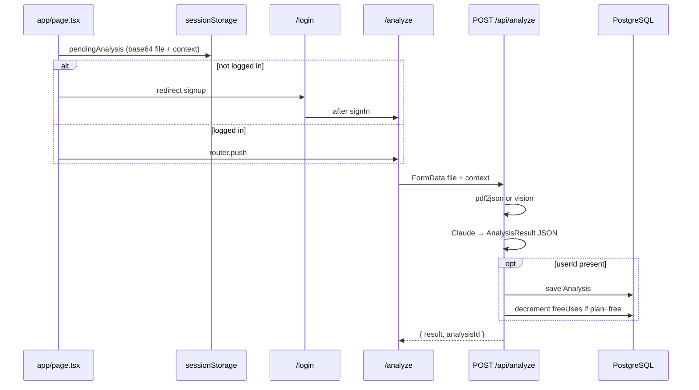

# ClearDoc — Project Memory (source of truth)

> **Last verified:** 2026-05-23. If anything here conflicts with code, **trust the code** and update this file.

## What this app is

ClearDoc helps everyday people understand scary official documents (insurance denials, medical bills, eviction notices, IRS letters, etc.).

**Output per analysis:** plain English summary, red flags with severity, a ready-to-send response letter, ranked next steps, and an overall verdict.

**Monetization:** Free tier = **1 saved analysis** per account → Pro = **$9/month** unlimited (Stripe subscription).

---

## Critical: what is NOT in this repo anymore

| Outdated (do not look for these) | Current replacement |
|----------------------------------|---------------------|
| Firebase Auth | **Auth.js (NextAuth v5)** — `auth.ts`, `/login`, `/api/auth/*` |
| Firestore | **PostgreSQL via Prisma** — `prisma/schema.prisma`, `lib/db.ts` |
| `lib/firebase.ts`, `firestore.ts`, `firebase-auth.ts` | **Deleted** — never reintroduce without explicit migration plan |
| `AuthModal.tsx` | **`app/login/page.tsx`** — full-page sign-in / sign-up |
| `middleware.ts` | **`proxy.ts`** — Next.js 16 request proxy (CSP + security headers) |
| Google OAuth in production | **Not wired** — only Credentials provider in `auth.ts`; `.env.example` still lists Google keys for future use |

---

## Tech stack (actual)

| Layer | Choice |
|-------|--------|
| Framework | **Next.js 16** App Router, React 19, TypeScript strict |
| Styling | **Tailwind CSS v4** — `@import "tailwindcss"` in `app/globals.css` (no `tailwind.config.js`) |
| Auth | **NextAuth v5** (`next-auth@5.0.0-beta.30`) + **Credentials** (email/password, scrypt) |
| Database | **PostgreSQL** + **Prisma 6** (`@prisma/client`, `lib/prisma.ts`) |
| AI | **Anthropic** `claude-sonnet-4-20250514` via `@anthropic-ai/sdk` (`lib/claude.ts`) |
| PDF | **pdf2json** server-side (`lib/pdf-parser.ts`); images → Claude vision |
| Payments | **Stripe** subscriptions (`lib/stripe.ts`, webhook + checkout routes) |
| Rate limit | **Upstash Redis** — optional; enabled only when `UPSTASH_REDIS_*` env vars are set |
| Motion / UI | **framer-motion**, **lucide-react**, editorial “Atelier” design in `globals.css` |
| Fonts | **Syne** (display) + **DM Sans** (body) — `app/layout.tsx` |

---

## Repository map

```
auth.ts                           — NextAuth config (Credentials, JWT sessions, Prisma adapter)
proxy.ts                          — CSP + security headers (Next.js 16 proxy, not middleware.ts)
next-auth.d.ts                    — Session.user.id typing

/app
  layout.tsx                      — Server: auth() → Providers(session) → Navbar + main + Footer
  page.tsx                        — Landing: upload, sessionStorage handoff, login gate
  globals.css                     — Design tokens (--ink, --ember, --bone, etc.)
  /login/page.tsx                 — Sign in / sign up (client); posts to /api/auth/signup then signIn()
  /analyze
    page.tsx                      — Runs analysis from sessionStorage; 4 result panels
    /[id]/page.tsx                — Reload saved analysis (auth required)
  /dashboard/page.tsx             — History list; ?upgraded=true after Stripe
  /pricing/page.tsx               — Pricing + checkout CTA
  /api
    /auth/[...nextauth]/route.ts  — NextAuth handlers
    /auth/signup/route.ts         — Create user + hashed password (before Credentials sign-in)
    /analyze/route.ts             — PDF/vision + Claude + optional save + quota
    /usage/route.ts               — Plan + freeUsesRemaining for AuthContext
    /analyses/route.ts            — List user's analyses (auth)
    /analyses/[id]/route.ts       — Single analysis (auth + ownership)
    /stripe/create-checkout/route.ts
    /stripe/webhook/route.ts

/components
  Providers.tsx                   — SessionProvider + AuthProvider
  /ui                             — Navbar, Footer, UploadZone, result panels, PricingModal, Kinetic, Atmosphere

/context
  AuthContext.tsx                 — Wraps useSession; loads profile from /api/usage

/hooks
  useAuth.ts                      — Re-export of context useAuth

/lib
  types.ts                        — AnalysisResult, UserPlanProfile, etc.
  db.ts                           — All Prisma data access (users, analyses, Stripe fields)
  prisma.ts                       — Singleton PrismaClient
  password.ts                     — scrypt hash/verify + validateEmail/validatePassword
  claude.ts                       — Claude API + system prompt + JSON parse
  pdf-parser.ts                   — pdf2json + image → vision payload
  stripe.ts                       — getStripe(), createCheckoutSession()

/prisma
  schema.prisma                   — User, Analysis, Auth.js Account/Session tables
  migrations/                     — Apply with: npx prisma migrate deploy
```

---

## Data model (Prisma / PostgreSQL)

### `User`
- `id` (cuid), `email` (unique), `password` (scrypt hash, nullable for legacy rows)
- `plan`: `"free"` \| `"pro"` (default `"free"`)
- `freeUsesRemaining`: int, default **1** for new signups
- `stripeCustomerId`, `stripeSubscriptionId`, `subscriptionStatus` (`active` \| `inactive` \| `cancelled`)
- Auth.js relations: `accounts`, `sessions`

### `Analysis`
- `id`, `userId`, `documentName`, `documentType` (user context string), `result` (JSON `AnalysisResult`)
- Index: `[userId, createdAt desc]`

**No file blob storage** — documents are not persisted; only Claude output JSON is saved.

---

## Auth flows

### Sign up
1. `POST /api/auth/signup` — validates email/password, `prisma.user.create` with `hashPassword`
2. Client calls `signIn("credentials", { email, password, redirect: false })`
3. JWT session includes `user.id` via callbacks in `auth.ts`

### Sign in
- `/login` or `/login?mode=signup&redirect=/analyze`
- Custom page: `pages.signIn: "/login"` in `auth.ts`

### Server session in API routes
```typescript
import { auth } from "@/auth"
const session = await auth()
const userId = session?.user?.id
```

### Client auth
```typescript
import { useAuth } from "@/hooks/useAuth" // or @/context/AuthContext
const { user, profile, loading, signOut, refreshProfile } = useAuth()
```
- `profile` comes from `GET /api/usage` (plan, freeUsesRemaining, subscriptionStatus)

---

## End-to-end analysis flow



### Product rules (implement exactly)

| Rule | Where |
|------|--------|
| Homepage **requires login** before analyze | `app/page.tsx` `handleAnalyze` |
| `/api/analyze` **can run without auth** (no save, no quota) | `app/api/analyze/route.ts` — UI gates this today |
| Free users: block when `freeUsesRemaining <= 0` | API returns `402` + `FREE_LIMIT_REACHED` |
| Pro users: **no** free-use check or decrement | `userProfile.plan === "pro"` |
| Max upload **10MB**; PDF, PNG, JPG, WEBP | analyze route + pdf-parser |
| Rate limit **15 req/hour/IP** if Upstash configured | analyze route |

---

## API routes reference

| Method | Path | Auth | Purpose |
|--------|------|------|---------|
| GET/POST | `/api/auth/[...nextauth]` | — | NextAuth |
| POST | `/api/auth/signup` | — | Register email/password |
| POST | `/api/analyze` | Optional | Analyze document |
| GET | `/api/usage` | Optional | Quota/plan (anonymous → zeros) |
| GET | `/api/analyses` | Required | List analyses |
| GET | `/api/analyses/[id]` | Required | One analysis (owner only) |
| POST | `/api/stripe/create-checkout` | Required | Stripe Checkout URL |
| POST | `/api/stripe/webhook` | Stripe sig | Subscription lifecycle |

---

## Stripe

- **Price:** $9/month (`unit_amount: 900` cents) — defined inline in `lib/stripe.ts`
- **Success:** `/dashboard?upgraded=true`
- **Webhook events:** `checkout.session.completed`, `customer.subscription.*`, `customer.subscription.deleted`
- **Local:** `stripe listen --forward-to localhost:3000/api/stripe/webhook`

---

## Environment variables

See `.env.example`. Required for full functionality:

```bash
DATABASE_URL=              # PostgreSQL (e.g. Render, Neon, Supabase)
NEXTAUTH_URL=              # e.g. http://localhost:3000
NEXTAUTH_SECRET=           # openssl rand -base64 32
ANTHROPIC_API_KEY=
STRIPE_SECRET_KEY=
STRIPE_WEBHOOK_SECRET=
NEXT_PUBLIC_APP_URL=       # Used in Stripe redirect URLs

# Optional
UPSTASH_REDIS_REST_URL=    # Rate limiting on /api/analyze
UPSTASH_REDIS_REST_TOKEN=
GOOGLE_CLIENT_ID=          # NOT used by auth.ts yet
GOOGLE_CLIENT_SECRET=
```

**Not used:** any `NEXT_PUBLIC_FIREBASE_*` or `FIREBASE_*` variables.

---

## Design system (“Atelier”)

Defined in `app/globals.css` — use CSS variables, not legacy hex from old docs.

| Token | Role |
|-------|------|
| `--ink`, `--ink-1`… | Near-black backgrounds |
| `--bone` | Paper-like surfaces on analysis views |
| `--text`, `--text-2`, `--text-3` | Typography hierarchy |
| `--ember` | Single accent (CTAs, highlights) |
| `--red`, `--amber`, `--moss` | Verdict / severity semantics |
| `.container-edition`, `.display`, `.eyebrow`, `.field`, `.btn` | Layout + component classes |

**UI building blocks:** `components/ui/Kinetic.tsx` (Reveal, SplitWords, Magnetic), `Atmosphere.tsx` (Grid, Vignette).

---

## Key conventions

### TypeScript
- Strict mode; prefer `lib/types.ts` interfaces
- Prisma `Analysis.result` is `Json` — cast to `AnalysisResult` when reading

### Components
- `"use client"` on interactive pages/components
- `useSearchParams()` inside `<Suspense>` (see `login`, `dashboard`)

### Security
- `proxy.ts` sets CSP (allows Anthropic + Stripe connect/frame)
- Passwords: `scrypt:<salt>:<hash>` in `lib/password.ts`
- Analysis fetch by id enforces `userId` in `getAnalysisById`

### Commands
```bash
npm install          # runs prisma generate (postinstall)
npx prisma migrate deploy   # production DB migrations
npm run dev
npm run build
```

---

## Known limitations / future work

- **Google OAuth** — env placeholders only; add provider to `auth.ts` if needed
- **Scanned PDFs** with no text — user context helps; OCR not implemented
- **Anonymous API analyze** — possible at API layer; product forces login on homepage
- **Document files** — not stored in DB or blob storage
- **Non-English** — Claude handles; UI doesn’t disclaim
- **Long docs** — truncated ~80k chars before Claude (`lib/claude.ts`)
- **README.md** — still default create-next-app boilerplate; ignore for architecture

---

## In-progress / uncommitted (check `git status`)

Typical active branch work (as of last doc update):

- Email/password auth: `auth.ts`, `lib/password.ts`, `app/api/auth/signup/route.ts`, `app/login/page.tsx`
- Prisma `User.password` + migration `20260523070000_add_user_password`
- Navbar / landing / AuthContext wired to `/login` instead of modal

After pulling changes, run migrations if `schema.prisma` changed:

```bash
npx prisma migrate dev    # local
npx prisma migrate deploy # production
```
